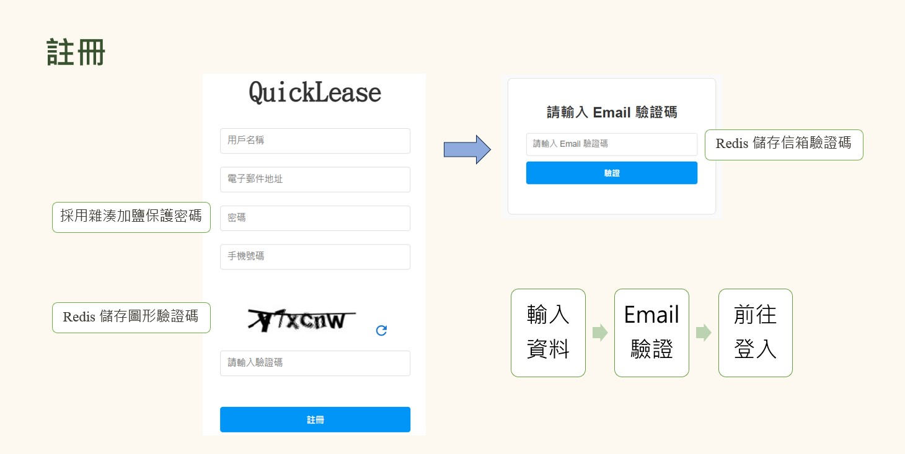

# 租屋平台 QuickLease

## 專題背景
　　靈感來自我在學生時期的租屋經驗。對許多學生來說，租屋是新學期開始前必須面對的課題，但這個過程並不輕鬆。常見的問題包括資訊來源分散，無法一次掌握所有選項；租屋流程繁瑣，與房東溝通效率低；甚至還有安全問題，例如不可靠的房東。這些痛點讓我深刻意識到，需要一個能簡化租屋流程、提高資訊透明度的解決方案。因此，QuickLease 應運而生。

## 專題目的
　　QuickLease 的核心目的是解決傳統租屋模式中的各種痛點。我們希望透過簡化流程、提高資訊透明度，構建一個安全可靠的平臺，來改善租屋經驗。讓用戶能輕鬆找到理想的房子。

## 系統設計

## 技術細節
- 前端：HTML, CSS, JavaScript, Material-UI
- 後端：Java, Spring boot
- 資料庫：MySQL, Redis
- 架構：MVC (Model-View-Controller), 包括 Controller, Service, DAO
- 安全性：
  - CAPTCHA 圖形驗證碼防止機器人攻擊，加強網站安全
  - SHA-256 密碼加鹽防止彩虹表攻擊，保護用戶隱私

## 資料庫架構

## 網站架構

## 畫面與功能
註冊與登入

  
  

